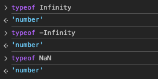
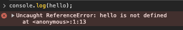
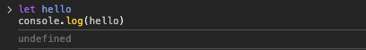
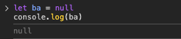
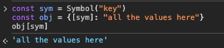
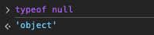

# Data Types 複習

## 原生值 Primitive values

該處重點是除了這幾個原生值之外，其他都是物件。

原生值還有個特性是 immutable 代表我們無法修改值的本身。這是什麼意思呢？

像是 String 來舉例，我們不能直接去修改 greeting 的內容，在 JS 中可以做到的只有指派新的值給他來取代（文中有提到 C 語言中，可以直接去修改該變數的值）

```
  let greeting = "Hi!";
  greeting = "你好";
```

* String  

因為其值 immutable ，所以就算使用 `substring()` 或是 `concat()` 最後也都是回傳新的字串，而不是修改原本的。

* Boolean

簡單來說就是 `true`, `false` 但要注意他們是小寫。

* Number

JS 中所有的整數、浮點數都一樣使用 Number 這個型別，就算是 `+Infinity`, `-Infinity`, `NaN`，

```
console.log(typeof NaN); // number
console.log(typeof -Infinity); // number
console.log(typeof Infinity); // number
```


這邊文中有提到 JS 中的 Number 精確度的範圍在 `-(2^53 - 1)` 到 `(2^53 -1)` 之間，超過了就得使用 `BigInt`


* BigInt

使用時機上面有提到了當超出 Number 精度範圍時可以使用。並且它一樣可以使用 +, *, -, **, 與  % 等運算子

重點： `BigInt` 與 `Number` 的值不能交互使用會出現 `TypeError`

* Undefined

JS 很有趣 undefined 自己是一個型別，也是一個值

如果沒有宣告變數就直接使用，會報錯 Uncaught ReferenceErro: not defined  


如果宣告變數了，但沒有只指派值給它  


* Null

`Null` 跟 `undefined` 很不一樣，它是一個值並且是賦予給變數用的。  


* Symbol
最後一個 JavaScript 原生值是 Symbol，它是一個獨特 (unique) 值，多半會搭配物件一起使用，作為物件的鍵 (key)。

```
const sym = Symbol("key");
const obj = { [sym]: "all the values here" };
obj[sym]; // all the values here
```


## 物件 Objects

> Objects, Arrays, Functions 都是 Object 喔！

這邊提一個大坑，null 的型別是 object 笑死  


typeof Array 就是 object
```
console.log(typeof []); // object
```

但是 function 使用 typeof 卻不一樣喔！
```
console.log(typeof function () {}); // function
```

這邊我們使用一個古老但超可靠的技巧，能夠正確回傳 JavaScript 值的內部類型資訊。

```
Object.prototype.toString.call(value)
```

| 值               | 回傳結果              |
|------------------|----------------------|
| `[]`             | `[object Array]`     |
| `{}`             | `[object Object]`    |
| `function () {}` | `[object Function]`  |
| `null`           | `[object Null]`      |
| `undefined`      | `[object Undefined]` |
| `123`            | `[object Number]`    |
| `"abc"`          | `[object String]`    |
| `true`           | `[object Boolean]`   |
| `new Date()`     | `[object Date]`      |
| `/abc/`          | `[object RegExp]`    |
| `new Map()`      | `[object Map]`       |
| `new Set()`      | `[object Set]`       |


💡 為什麼 typeof 不夠？  
	* `typeof` `[]` 回傳 `"object"`（不準）
	* `typeof` `null` 回傳 `"object"`（錯得離譜）
	* `typeof` `(() => {})` 回傳 `"function"`（只有這個比較準）